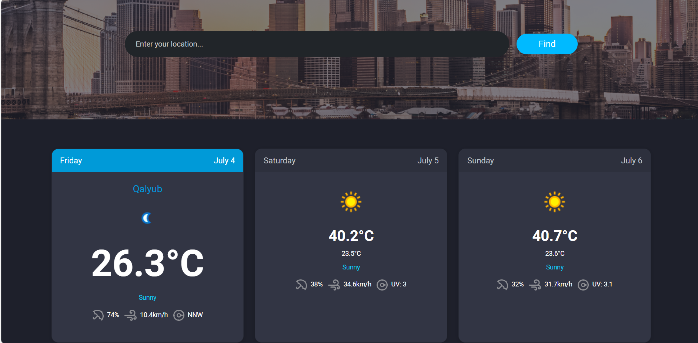

# 🌦️ Smart Weather App

> ✅ Challenge 5 – JavaScript Project by Rout Academy

A fully responsive **Smart Weather App** built with **Vanilla JavaScript**, **HTML**, **Bootstrap**, and the **OpenWeatherMap API**.

## 🚀 Features

- 🔍 Live search for any city
- 🌡️ Shows current temperature, weather condition, humidity, wind speed, and UV index
- 🎨 Dynamic background and weather icon based on conditions
- 📱 Fully responsive using Bootstrap
- ⏳ Loading animation while fetching data
- ❌ Error handling for invalid or empty city names
- ⚙️ 100% frontend (no backend)

## 🖼️ Screenshot

## 🔗 Live Demo

👉 [Click here to view the live app](https://responsive-weather-app-five.vercel.app/)

## 📂 GitHub Repository

👉 [View the source code on GitHub](https://github.com/Mokhtar-Mohammed-Ali/responsive-weather-app)

## 📦 Built With

- HTML  
- CSS / Bootstrap  
- JavaScript  
- [OpenWeatherMap API](https://openweathermap.org/api)

## 🙋‍♂️ Author

**Mokhtar Mohamed**  
GitHub: [@Mokhtar-Mohammed-Ali](https://github.com/Mokhtar-Mohammed-Ali)

